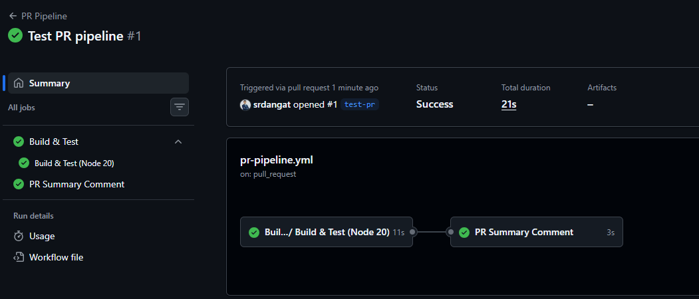
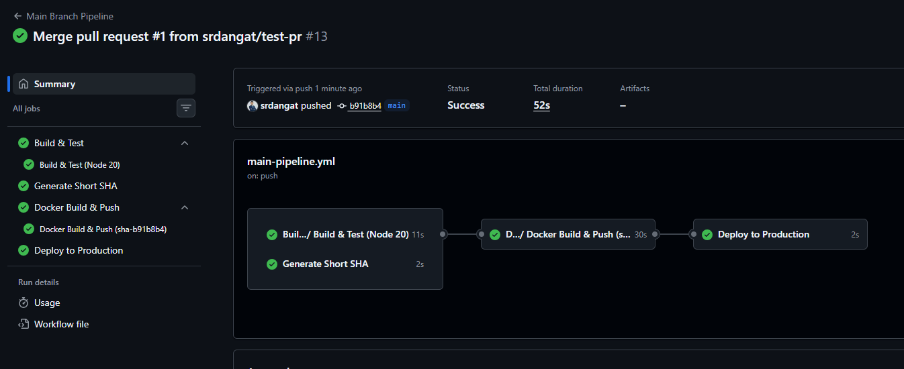
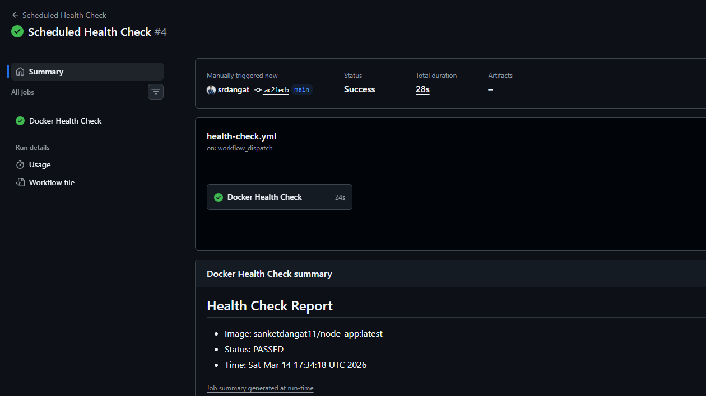

   # End-to-End CI/CD Pipeline with GitHub Actions

## 📌 Project Overview

This repository demonstrates a **DevSecOps CI/CD pipeline** for a **Node.js Express** application. It focuses on the "Shift-Left" security, ensuring that security and quality checks are integrated deep into the automated workflow.

The application serves a simple `/health` endpoint, while the infrastructure provides a robust pipeline that automates everything from unit testing to security-hardened container deployments.

---

<p align="center">
  <a href="https://github.com/srdangat/github-actions-capstone/actions/workflows/main-pipeline.yml">
    
  </a>
  <a href="https://github.com/srdangat/github-actions-capstone/actions/workflows/pr-pipeline.yml">
    
  </a>
  <a href="https://github.com/srdangat/github-actions-capstone/actions/workflows/health-check.yml">
    
  </a>
  <a href="https://hub.docker.com/repository/docker/sanketdangat11/node-app">
    
  </a>
</p>


## 🔄 Pipeline Workflows

### 1. Pull Request Flow (Continuous Integration)
**Trigger**: When a PR is opened or updated targeting the `main` branch.
> PR Opened → **Build & Test** → PR Checks Pass

### 2. Main Branch Flow (Continuous Deployment)
**Trigger**: When code is merged into the `main` branch.
> Merge to Main → **Build & Test** → **Docker Build & Push** → **Trivy Security Scan** → **Deploy**

### 3. Scheduled Monitoring
**Trigger**: Every 12 hours via GitHub Actions Cron.
> Every 12 Hours → **Health Check**

---

## 🛠️ Tech Stack

- **Backend**: [Node.js](https://nodejs.org/) (v18+) & [Express](https://expressjs.com/)
- **Containerization**: [Docker](https://www.docker.com/) & Multi-stage builds
- **CI/CD**: [GitHub Actions](https://github.com/features/actions)
- **Security**: [Trivy](https://github.com/aquasecurity/trivy) (Shift-Left Vulnerability Scanning)
- **Testing**: Node.js Test Runner & Smoke Tests

---

## PR Pipeline
   


## Main Branch Pipeline




## Scheduled Health Check




## 🚀 Getting Started

### 1. Running Locally

Ensure you have [Node.js](https://nodejs.org/) installed on your machine.

1. **Install dependencies**:
   ```bash
   npm install
   ```

2. **Start the application**:
   ```bash
   npm start
   ```

3. **Verify the endpoint**:
   Open `http://localhost:3000/health` in your browser.

---

### 2. Running with Docker

This project uses multi-stage builds and non-root user isolation for security.

1. **Build the image**:
   ```bash
   docker build -t node-app .
   ```

2. **Run the container**:
   ```bash
   docker run -p 3000:3000 node-app
   ```

3. **Check health**:
   ```bash
   curl http://localhost:3000/health
   ```

---

### 🔗 3. GitHub Actions CI/CD

The pipeline is fully automated and triggered by Git events:

- **Continuous Integration (PR)**: Runs on every Pull Request to `main`. It validates builds and tests.
- **Continuous Deployment (Push)**: Runs when code is merged into `main`. It builds the Docker image, performs a **Trivy Security Scan**, and pushes to Docker Hub.
- **Scheduled Checks**: Every 12 hours, a monitoring job runs to ensure the production endpoint is healthy.
